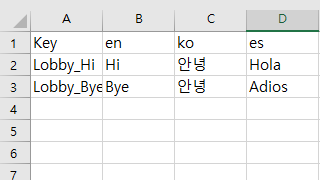
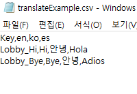
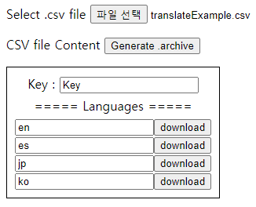
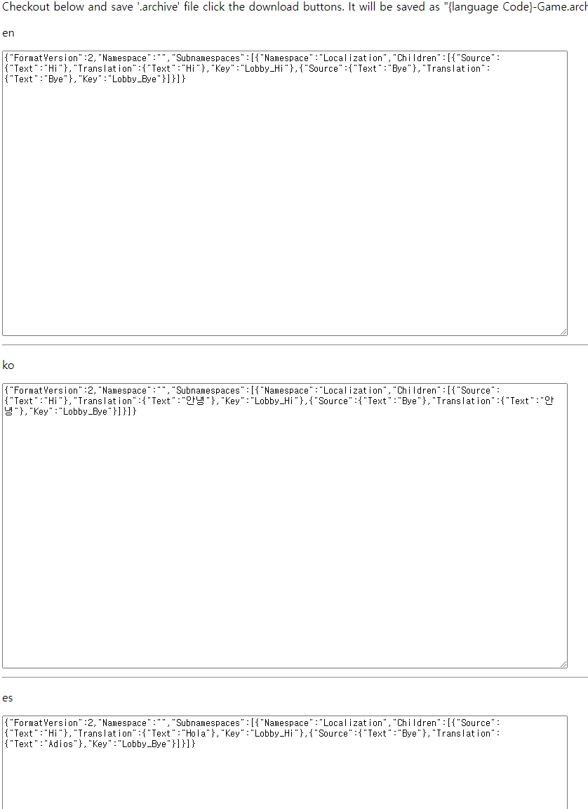
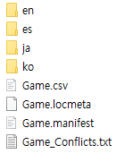

# UE4 Easy Localization CSV Converter
For easy localization job

# SOMEBODY HELP ME!
### I'M LOOKING FOR SOMEBODY MAKING DESIGN AS GOOD AS POSSIBLE!
I can make it using `css`. But as you can see, i'm poor at design. I'm sure you don't want to see my rainbow-gradation design. You can contact me on Issue tab.

# HOW TO
## 1. Make your translation '.csv' file like below.

Make sure the first language is the main language
## 2. Run Convert.html
## 3. Select your `.csv` file

## 4. Checkout your `.archive` contents

## 5. Click the download button
It will be saved as `{language Code}-Game.archive' on your computer. It doesn't need server. It is worked in client-side.

## 6. Enjoy your office-life with your co-worker designer!
Done! Just move the files on Localization directory in your project! Ofcourse you will have to change your file names to `Game.archive` and move it into correct directory.

